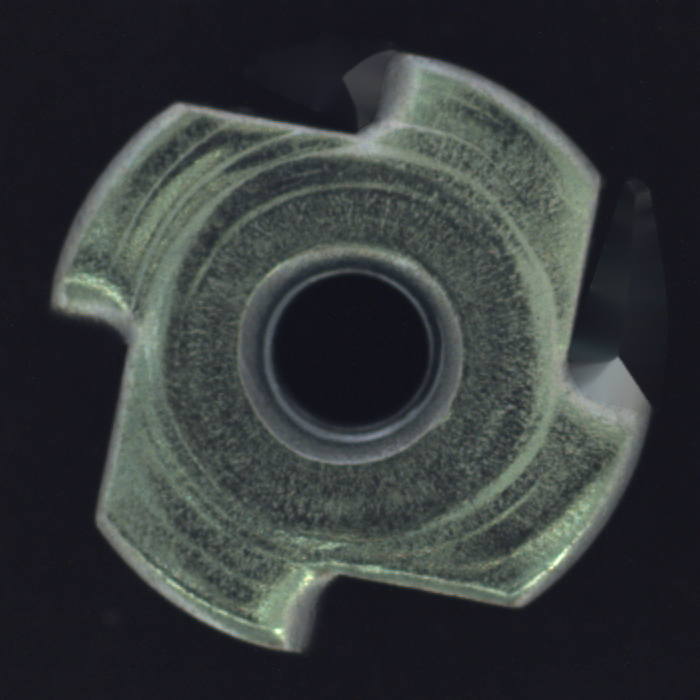
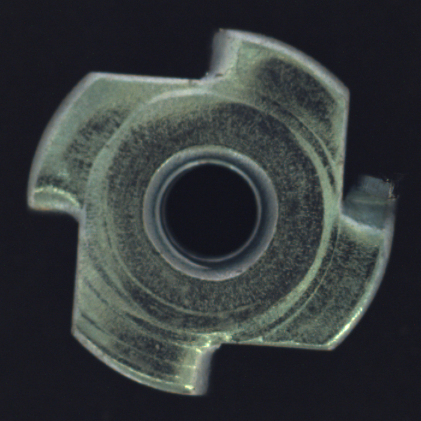
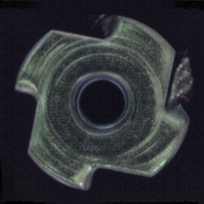

## *Style-Conditioned Industrial Defect Generation using UNet-FiLM + ViT Discriminator*

---
 
This repo focuses on conditional generative model that **creates realistic industrial defects** (scratch, crack, hole, dent, etc.) on **clean MVTec images**.   The generator is a **FiLM-conditioned UNet**, and the discriminator is a **DINO ViT**, enabling both **local texture realism** and **global semantic consistency**.

## Architecture

```
                         ┌────────────────────────┐
Clean Image ───────────▶ │      UNet Generator    │ ─────────────▶ Fake Defect Image
                         │   + FiLM (Style Input) │
Style Label ───────────▶ └────────────────────────┘
                                     │
                                     ▼
                          ┌─────────────────────┐
                          │   ViT Discriminator │
                          │  (Real/Fake + Style)│
Real Defect Image ─────▶ │   DINO ViT (pretrained)
                          └─────────────────────┘
```

### **Generator (UNet + FiLM)**  
- Takes a **clean image** + **style label**  
- FiLM injects style (scratch, crack, hole) via **γ, β modulation**  
- Produces a **fake defect image** in range `[-1, 1]`  

### **Discriminator (DINO ViT)**  
- Takes **image + style label**  
- Predicts:
  - **Real vs Fake**
  - **Style class**  
- Global ViT attention ensures defects are realistic and consistent with object shape.

## Dataset Preparation (MVTec AD)

### 1. Download  
MVTec AD dataset:  
https://www.mvtec.com/company/research/datasets/mvtec-ad

### 2. Folder structure (per category)
```
mvtec/
  metal_nut/
    train/
      good/
    test/
      good/
      crack/
      scratch/
      ...  
    ground_truth/
      crack/
      scratch/
      ...
```
### 3. Preparing the dataset  

```bash
python dataset.py
```
### 4. Final Dataset  
The dataset loader returns:
```
clean
defective
masks
style_label.json
```

##  Training

Run:

```bash
python train.py
```

Training includes:
- UNet generator forward  
- ViT discriminator evaluation  
- Masked L1 loss on defect region  
- Adversarial loss  
- Style classification loss  
- Best-model checkpoint saved automatically  

---

## Inference

Generate defect on a clean image:

```bash
python inference.py
```

Produces:

```
fake_defect_output.png
```

You can choose defect style via label:
```
style = "scratch" | "crack" | "hole" | ...
```

---

## Results
<table align="center">
  <tr>
    <th>Clean Image</th>
    <th>Real defect</th>
    <th>Generated defect</th>
  </tr>
  <tr>
    <td align="center">
      
    </td>
    <td align="center">
      
    </td>
    <td align="center">
      
    </td>
  </tr>
</table>


## References  

### **FiLM conditioning**  
**Perez et al., “FiLM: Visual Reasoning with a General Conditioning Layer”**, ICLR 2018.  
https://arxiv.org/abs/1709.07871

### **Conditional GAN via One-vs-All Classifier**  
**Xu et al., “Conditional Image Generation with One-Vs-All Classifier”**, 2020.  
https://arxiv.org/abs/2009.08688
